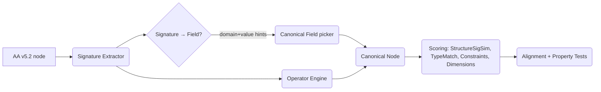

You’re right—the lookup table vibe isn’t it. If we want this to breathe, the compiler has to **discover** structure from the elections themselves and use a handful of **generic operators** to reconcile vendor layouts.

Below is a drop‑in upgrade that keeps your canonical field idea but replaces the brittle “variant catalog” with **runtime pattern discovery**.

---

## TL;DR → Actions → Context

**TL;DR**
Move to a **structure‑first compiler** that (1) extracts a **structural signature** from each election, (2) infers dimensions (e.g., contribution types) from option text, (3) maps via **generic operators** (replicate, bind, gate, aggregate) instead of per‑vendor variants, and (4) uses the canonical taxonomy for naming only. This scales to unseen layouts.

**Actions (today)**

1. Add the **Signature Extractor** (spec + code shape below).
2. Add the **Operator Engine** with 4 primitives.
3. Swap your scorer to include **StructureSigSim** + **DimensionMatch**.
4. Instrument the compile to log discovery metrics (coverage, novel patterns).
5. Run on all 732; if compile success ≥80%, keep iterating. If not, enable **unsupervised pattern mining** (k‑modes/HDBSCAN) to learn new shapes automatically.

**Context anchors**

- Relius “**Age 21**” = single scalar + applies‑to checkboxes.
- Ascensus “**Age Requirement**” = per‑source rows (Pre‑Tax, Roth, Matching, Profit Sharing, Safe Harbor/QACA, QNEC).
- Your v5.2 extractor already exposes the pieces we need: `form_elements`, `options`, `section_context`, stable `section_path`.
- The embedding test stalled exactly on structure‑heavy items—motivation for this shift.

---

## Architecture (discovery-first, still canonical)



**Key idea:** The **signature** determines structure and dimensions; the **taxonomy** names the thing (`eligibility.age`, etc.). Operators reconcile shapes without a vendor-specific table.

---

## 1) Structural Signature Spec (v0.1)

> Save as `ceo.struct_signature.schema.json`

```json
{
  "$id": "https://ceo.sentientsergio/schema/struct_signature.schema.json",
  "$schema": "https://json-schema.org/draft/2020-12/schema",
  "title": "CEO Structural Signature",
  "type": "object",
  "required": [
    "shape",
    "controls",
    "option_count",
    "dimension_hits",
    "value_hints",
    "constraints_hints",
    "hierarchy"
  ],
  "properties": {
    "shape": {
      "type": "string",
      "enum": [
        "scalar_boolean", // single checkbox or yes/no radio
        "scalar_numeric", // one textbox or numeric-labeled line (e.g., Age 21)
        "menu", // single-select among named options
        "checklist", // multi-select among options
        "menu_plus_other", // menu with 'Other: ____'
        "array_by_dimension", // per-type rows (e.g., one age per contribution type)
        "toggle_plus_detail", // 'same/different' parent with children elections
        "schedule_grid", // vesting years x % (or equivalent)
        "text_block" // no form elements (informational)
      ]
    },
    "controls": {
      "type": "object",
      "properties": {
        "checkbox": { "type": "integer", "minimum": 0 },
        "text": { "type": "integer", "minimum": 0 },
        "radio": { "type": "integer", "minimum": 0 },
        "grid": { "type": "integer", "minimum": 0 }
      }
    },
    "option_count": { "type": "integer", "minimum": 0 },
    "has_other_option": { "type": "boolean" },
    "has_any_fill_ins": { "type": "boolean" },
    "fill_in_kinds": {
      "type": "array",
      "items": {
        "type": "string",
        "enum": ["text", "number", "currency", "percent", "date"]
      }
    },
    "dimension_hits": {
      "type": "object",
      "properties": {
        "contribution_type": { "type": "array", "items": { "type": "string" } },
        "participant_class": { "type": "array", "items": { "type": "string" } }
      }
    },
    "value_hints": {
      "type": "array",
      "items": {
        "type": "string",
        "enum": ["age_years", "hours", "percent", "dollars", "date", "schedule"]
      }
    },
    "numeric_literals": { "type": "array", "items": { "type": "number" } },
    "unit_hints": {
      "type": "array",
      "items": {
        "type": "string",
        "enum": ["years", "hours", "percent", "dollars"]
      }
    },
    "constraints_hints": {
      "type": "object",
      "properties": {
        "max_implied": { "type": ["number", "null"] },
        "min_implied": { "type": ["number", "null"] },
        "not_to_exceed": { "type": ["number", "null"] }
      }
    },
    "dependency_hints": {
      "type": "object",
      "properties": {
        "select_one": { "type": "boolean" },
        "select_all_apply": { "type": "boolean" },
        "has_parent_toggle": { "type": "boolean" }
      }
    },
    "hierarchy": {
      "type": "object",
      "properties": {
        "depth": { "type": "integer", "minimum": 0 },
        "path_suffix_kind": {
          "type": "string",
          "enum": ["numbered", "lettered", "UNK"]
        }
      }
    },
    "label_tokens": { "type": "array", "items": { "type": "string" } } // normalized tokens for later LabelSim
  }
}
```

**Notes tied to your samples**

- Relius “Age 21” → `shape="scalar_numeric"`, `dimension_hits.contribution_type=["pretax","matching","nonelective", maybe "roth/SH"]`, `value_hints=["age_years"]`, `constraints_hints.max_implied=21`.
- Ascensus “Age Requirement” → `shape="array_by_dimension"` with six contribution types detected.
- Entry Date “same/different” → `shape="toggle_plus_detail"`.

---

## 2) Generic Operator Engine (vendor-agnostic)

> Save as `ceo.operators.json`

```json
{
  "version": "0.1",
  "operators": [
    {
      "id": "replicate_across_dimension",
      "when": {
        "source.shape": "scalar_numeric",
        "source.dimension_hits.contribution_type.length>": 1
      },
      "effect": "Emit multiple canonical nodes (one per contribution_type) with identical scalar value/constraint."
    },
    {
      "id": "bind_dimension_value",
      "when": { "source.shape": "array_by_dimension" },
      "effect": "For each per-type row or checkbox+textbox, bind {dimension_values: {contribution_type: <type>}} on the emitted node."
    },
    {
      "id": "gate_by_toggle",
      "when": { "source.shape": "toggle_plus_detail" },
      "effect": "Create dependency bundle: parent controls whether child detail nodes are required/active."
    },
    {
      "id": "aggregate_or_cap",
      "when": {
        "source.value_hints": ["percent", "dollars"],
        "source.label_tokens~": "maximum|cap|not to exceed"
      },
      "effect": "Normalize to contributions.match.max.* with appropriate units."
    }
  ]
}
```

These four cover the Age/Entry/Vesting/Match/Loans cases we’ve seen—without encoding _who_ the vendor is. The same rules fire on any vendor that presents the shape.

---

## 3) Compiler (discovery-first) — core algorithm

> Pseudocode you can drop into your pipeline

```python
def extract_signature(e):
    # e = v5.2 node
    # 1) controls
    controls = Counter([fe["element_type"] for fe in e.get("form_elements", [])])
    # 2) shape inference
    shape = infer_shape(e, controls)  # scalar_numeric/checklist/array_by_dimension/etc.
    # 3) dimension hits (dictionary-driven, not model-driven)
    dim_hits = {
        "contribution_type": detect_contribution_types(e),   # maps Pre-Tax, Roth, Matching, etc.
        "participant_class": detect_participant_classes(e)
    }
    # 4) value & unit hints
    vh, uh, nums = detect_value_units_and_numbers(e)
    # 5) constraints hints
    ch = detect_constraints_hints(e, nums)
    # 6) dependencies and hierarchy
    deps = detect_dependencies(e)
    hier = infer_hierarchy(e["section_path"])
    # 7) tokens for LabelSim (cheap)
    tokens = normalize_tokens([e.get("section_title",""), e.get("provision_text",""), *(opt.get("option_text","") for opt in e.get("options",[]))])

    return {
        "shape": shape,
        "controls": {"checkbox":controls["checkbox"], "text":controls["text"], "radio":controls["radio"], "grid":controls["grid"]},
        "option_count": len(e.get("options",[])),
        "has_other_option": any("other" in (opt.get("option_text","").lower()) for opt in e.get("options",[])),
        "has_any_fill_ins": any(opt.get("fill_ins") for opt in e.get("options",[])),
        "fill_in_kinds": infer_fill_in_kinds(e),
        "dimension_hits": dim_hits,
        "value_hints": list(vh),
        "numeric_literals": nums,
        "unit_hints": list(uh),
        "constraints_hints": ch,
        "dependency_hints": deps,
        "hierarchy": hier,
        "label_tokens": tokens
    }

def compile_with_discovery(e, taxonomy):
    sig = extract_signature(e)
    # 1) pick domain + canonical_field by cheap rules + synonyms
    domain = infer_domain(e)            # from section_context/title (eligibility/vesting/...)
    cand_fields = candidates_from_taxonomy(domain, sig.value_hints, sig.label_tokens, taxonomy)
    canonical = choose_best(cand_fields, sig)  # Type/Units first, labels last

    # 2) apply generic operators
    nodes = apply_operators(sig, canonical)

    # 3) finalize constraints from hints (e.g., “Age 21” → max=21)
    for n in nodes:
        n["constraints"] = finalize_constraints(n, sig)

    # 4) confidence
    conf = confidence_from(sig, canonical)  # high when Type/Units/Dimensions align

    return nodes, conf, sig
```

**Why it generalizes**

- The **shape** and **dimension_hits** drive behavior. “Relius Age 21” (scalar+applies‑to) and “Ascensus Age Requirement” (array_by_dimension) are just two shapes; the same rules will work on any vendor that expresses them similarly.

---

## 4) Updated Scoring (v0.2)

> Save as `ceo.match_scoring.v0.2.json`

```json
{
  "version": "0.2",
  "weights": {
    "StructureSigSim": 0.35,
    "TypeMatch": 0.25,
    "DimensionMatch": 0.15,
    "ConstraintCompat": 0.15,
    "LabelSim": 0.05,
    "DomainHintSim": 0.05
  },
  "components": {
    "StructureSigSim": "Jaccard over categorical shape features + Hamming over control presence + MSE penalty over counts; bonus if both sides are array_by_dimension with same dimension set.",
    "TypeMatch": "Exact match on value_type + units; partial credit for numeric compat.",
    "DimensionMatch": "1.0 when contribution_type sets equal; 0.5 for subset; 0 for disjoint.",
    "ConstraintCompat": "1.0 when source constraints within target bounds; 0.5 overlap; else 0.",
    "LabelSim": "Char-trigram Jaccard over label_tokens.",
    "DomainHintSim": "1.0 if domain from section_context aligns; 0.5 if adjacent (eligibility↔vesting service)."
  },
  "thresholds": { "auto_accept": 0.85, "review": 0.7, "reject": 0.5 }
}
```

---

## 5) Unsupervised Pattern Mining (only if needed)

If compile success <80%, add a **pattern miner**:

```python
def discover_structural_patterns(elections):
    sigs = [extract_signature(e) for e in elections]
    X = vectorize_signatures(sigs)  # one-hot on shape, fill_in_kinds, dimension hits; counts kept numeric
    clusters = kmodes_or_hdbscan(X) # choose categorical-friendly algo
    # For each cluster, emit a learned pattern descriptor with canonical operator suggestions
    return summarize_clusters(clusters, sigs)
```

This yields **learned patterns** (e.g., many menus with “Other” + per-type text fill-ins → `menu_plus_other` + `bind_dimension_value`) rather than hardcoding per vendor.

---

## 6) Instrumentation to measure “real” coverage

> Add these counters to your compile loop:

```text
metrics:
  total_elections
  by_domain: {eligibility, vesting, contributions, loans, distributions}
  compile_success: count, pct
  unknown_field: count, pct
  unknown_shape: count, pct
  operators_used: {replicate_across_dimension:n, bind_dimension_value:n, gate_by_toggle:n, aggregate_or_cap:n}
  novel_dimension_tokens: top 20 strings not in dictionary
  signature_families: top 10 (shape + dimension_presence + control pattern)
```

**Decision rule:**

- If `compile_success ≥ 0.80`: stay on Path 1 (expand dictionaries + taxonomy gradually).
- Else: enable miner and absorb the top 3 new **signature families**.

---

## 7) Dimension dictionaries (tiny, curated)

Seed list for `contribution_type` detection (case/spacing/inflection tolerant):

```json
{
  "contribution_type_lexicon": {
    "pretax": [
      "pre-tax",
      "pre tax",
      "pre tax elective deferrals",
      "elective deferrals"
    ],
    "roth": ["roth", "roth elective deferrals"],
    "matching": ["match", "matching contributions"],
    "nonelective": ["nonelective", "non-elective"],
    "profit_sharing": ["profit sharing", "profit-sharing"],
    "safe_harbor": ["safe harbor"],
    "qaca_safe_harbor": ["qaca safe harbor", "qaca"],
    "qnec": ["qnec", "qualified nonelective"]
  }
}
```

This is how the extractor will recognize both Relius applies‑to checkboxes and Ascensus per‑row labels without bespoke vendor code. (Examples appear verbatim in your samples.)

---

## 8) Where this touches your prior artifacts

- Keep the **canonical taxonomy** you started with (coarse fields like `eligibility.age`). It’s still the right pivot.
- **Replace** the structural variant catalog with the **Signature + Operator** pair.
- Your existing v5.2 keys slot straight in (no extractor changes).

---

## 9) Sanity checks (property probes still work)

- **Age 21**

  - Relius signature ⇒ `scalar_numeric` + `dimension_hits=[elective, matching, nonelective, …]` → operator `replicate_across_dimension`.
  - Ascensus signature ⇒ `array_by_dimension` → operator `bind_dimension_value`.
  - Result: equivalent nodes under `eligibility.age`; probe passes.

- **Entry Date**

  - Relius ⇒ `toggle_plus_detail` gating.
  - Ascensus ⇒ `menu_plus_other` with per‑type text fill-ins.
  - Both become `eligibility.entry.frequency` (+ `other_text` when needed).

---

## Answering your closing question

**Yes—run the full corpus compilation.** Use the instrumentation above so the result tells us whether we can stay incremental or need the miner. If you want, I can help wire the signature extractor + operators into your repo in a small PR.

---

### Appendix — Minimal heuristics you can copy

**`infer_shape`**

- If `form_elements` empty → `text_block`.
- If 1 checkbox or Yes/No radio → `scalar_boolean`.
- If any numeric literal in label (“Age 21”, “not to exceed 1,000”) or a single text box with numeric hint → `scalar_numeric`.
- If options and any option contains “Other” with text fill‑in → `menu_plus_other`.
- If options look like contribution types (via lexicon) and each has its own checkbox/text → `array_by_dimension`.
- If parent line includes “same for all / different by …” → `toggle_plus_detail`.
- If options encode years→percent rows → `schedule_grid`.

**`infer_domain`** (priority order; from `section_context`/title):

- contains “Eligibility”, “Entry”, “Age” → `eligibility`.
- “Vesting”, “Years of Service” → `vesting`.
- “Matching”, “Safe Harbor”, “QACA” → `contributions`.
- “Loan” → `loans`.
- “Hardship”, “In‑service”, “RMD” → `distributions`.
  (These tokens are present in your samples and spec.)

**`detect_constraints_hints`**

- Regex `not to exceed (\d[\d,]*)` → `max`.
- “Age 21” line with a checkbox → set `max_implied=21`.
- “**\_** %” fill‑ins → unit hint `%`.

---

### Why this fixes the “1.5% coverage” problem

- **Discovery replaces enumeration.** New vendors get classified by **shape + dimensions**, not by name.
- **Operators are universal.** Replicate/bind/gate/aggregate cover most UI differences we see across AAs.
- **Taxonomy remains small.** We don’t explode paths for each contribution type; we bind dimensions at runtime.

---

If you want me to keep going, I can turn the spec above into a tiny Python module with unit tests against the Relius/Ascensus samples you shared so your dev can drop it into the pipeline.
